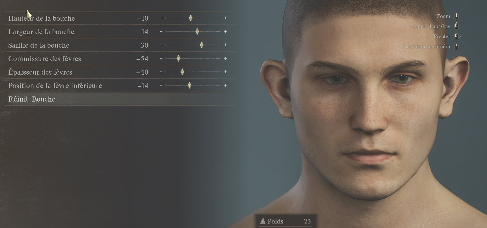
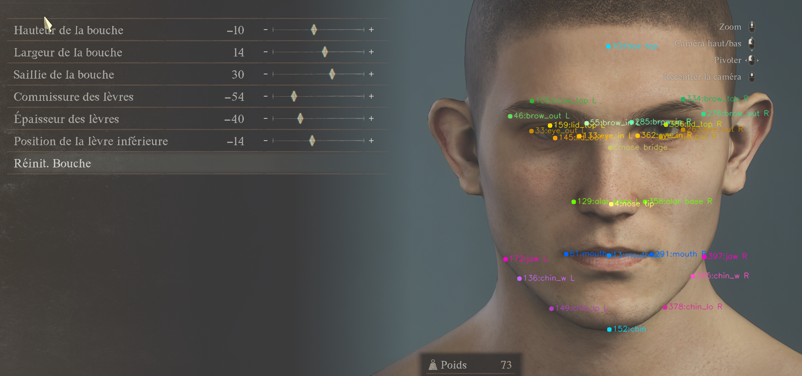

# FaceForge

> **This is a proof of concept.** The goal is not to prove that a human face will look identical in Dragon's Dogma 2 — it won't. The goal is to check whether the slider values produced are *coherent* with the morphology of the input face.

FaceForge analyzes a portrait photo and maps facial proportions to DD2 character creator sliders using facial landmark detection.

---

## How it works

A front-facing portrait is processed through this pipeline:

1. **Face gate** - decode image and detect exactly one face (Haar Cascade)
2. **Landmark extraction** - MediaPipe Face Landmarker computes facial landmarks
3. **Quality scoring** - blur (face crop), lighting (full image), pose (eye alignment)
4. **Pitch warning** - pitch is evaluated and can produce a warning message
5. **Slider mapping** - ratios are interpolated against calibration anchors to produce 18 DD2 slider values

Notes:
- Very blurry images are rejected (`Image too blurry to process...`).
- Pitch is currently a warning, not a hard rejection.

### Landmark detection

| Without landmarks | With landmarks |
|---|---|
|  |  |

---

## Getting started

### Requirements

- Python 3.10+
- Node.js 20.19+ or 22.12+

### Backend

```bash
cd backend
pip install -r requirements.txt
uvicorn main:app --reload
```

The API will be available at `http://localhost:8000`.

### Frontend

```bash
cd frontend
npm install
npm run dev
```

The app will be available at `http://localhost:5173`.

---

## Usage

1. Open the app in your browser
2. Drop a front-facing portrait (well-lit, neutral expression, head straight)
3. The app returns 18 DD2 slider values with a quality score
4. Depending on quality, the API returns either:
   - `status: "ok"` (possibly with a warning message)
   - `status: "rejected"` with a rejection reason

---

## Sliders covered

`eye_spacing` · `eye_size` · `nose_width` · `nose_length` · `mouth_width` · `mouth_corner` · `jaw_width` · `jaw_position` · `chin_width` · `face_length` · `brow_spacing` · `brow_height` · `brow_angle` · `brow_curve` · `lip_thickness` · `eye_tilt` · `eye_height` · `mouth_height`

> `jaw_definition` is not implemented — its effect is purely 3D and undetectable from a front-facing photo.
